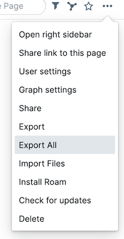
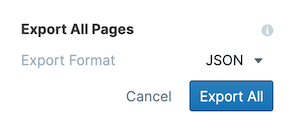

# roam2agora

`roam2agora` is a privacy-respecting CLI utility to convert parts of a roam graph into a digital garden for use in [the agora](https://anagora.org/).

For now you'll need a working python installation in order to use it. If you haven't installed python before, the easiest way to get started is to install [anaconda](https://www.anaconda.com/products/individual#Downloads).

## tl;dr
- Add `#public` or `#public_page` to blocks in your roam graph, and export your graph as JSON
- Run `roam2agora -i <your-roam-export>.json -o ~/<your-agora-folder>` 
- `~/<your-agora-folder>` now contains markdown versions of just the public parts of your graph, ready for upload to [the agora](https://anagora.org/) or use in a digital garden.

## Features

Privacy controls!
- `roam2agora` let's you specify which blocks or pages you'd like to share, via a set of special tags:
    - tagging a block with `#public` will cause that block (and any subblocks) to be exported to the agora
    - tagging a block with `#private` will *prevent* a block from being exported to the agora. You can mix and match this with `#public` if you'd like to export a top-level block, but not some of it's descendants. `#private` always takes priority over public.
    - tagging a block with `#public_page` anywhere on a page will cause the entire page to be exported to the agora. You can still use `#private` tags on the page if there are parts of the page that you don't want to include in the export.
    - tagging a block with `#private_page` will prevent a page from being exported. Be careful, `#private_page` takes precedence over `#public` and `#public_page`, so if you include a `#private_page` block on a page that also has a `#public` block the entire page will be excluded from the export.

## Caveats

> ⚠️ `roam2agora` is early stage software! Use at your own risk and make sure to manually check that nothing that you didn't want shared gets included in the export.

## Usage

### Prepare a JSON roam export

First, you need to export the roam graph that contains the content you'd like to publish from the agora. 

- To do this (as of Nov 2020), click the "..." icon at the upper right of Roam and choose `Export All.`

    

- Make sure to choose `JSON` for the export format:

    

- Unzip the zip file, and take note of the path to the `.json` file that comes out.

### Install and run roam2agora

Once you've got your roam export prepared, install `roam2agora` via `pip`:

```bash
pip install git+ssh://git@github.com/nikvdp/roam2agora.git#egg=roam2agora
```

If all went well you can now see the usage instructions via `roam2agora --help`:

```bash
Usage: roam2agora [OPTIONS]

Options:
  -i, --roam-export-file FILE
  -o, --output-folder DIRECTORY
  -h, --help                     Show this message and exit.
```

To run it, use the `-i` option to specify the source import file you saved earlier, and the `-o` option to specify an agora folder to save the resulting markdown files too. For example, if you unzippped the roam json to your home folder's `Downloads` directory, you'd run a command like the below (replacing `<graph-name>` with your graph's name of course).

```bash
roam2agora -i ~/Downloads/<graph-name>.json -o ~/agora
```

You're done! Just make sure to **check all your files to make sure that nothing you want to stay private was accidentally included** in the export!

### Add your files to the agora

All that's left is to get your new markdown folder into the public agora! To do this, get in touch with [@flancian](https://twitter.com/flancian) on twitter or take a look at the [agora's github repo](https://github.com/flancian/agora).
